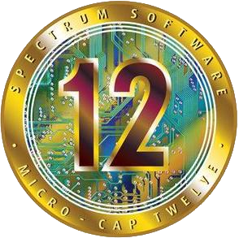
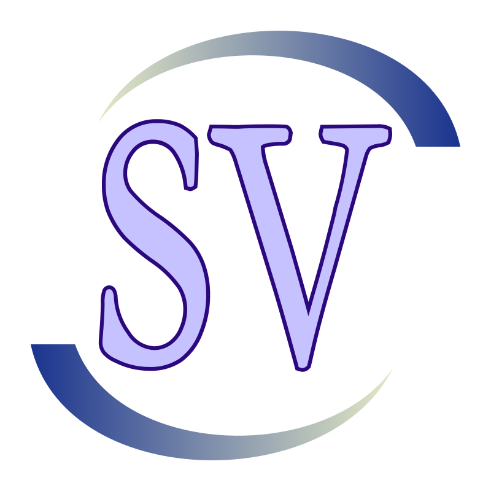
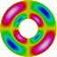
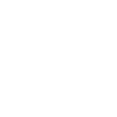
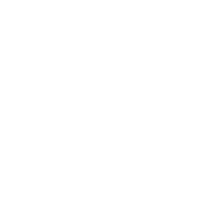

# 👋 &nbsp;Hi there

I specialize in designing and optimizing electrical devices. This provides me with opportunities to solve unique challenges and investigate anomalies in existing systems. I also love combining my work experience with my hobbies like 3D printing, woodworking, and programing into various personal projects with RaspberryPi's, Arduinos, or dedicated PIC MCUs. Feel free to [email me](mailto:matthewsantos@ieee.org) any time or find me on [Linkedin](https://www.linkedin.com/in/matthewjsantos). You can also check out my website at [Matt-Santos.github.io](https://Matt-Santos.github.io).

## 🧰 &nbsp;My toolbox

### **Programing Languages**

	
	
	
	
	
	
	
	
	
	<picture>
		<source srcset="https://raw.githubusercontent.com/odb/official-bash-logo/refs/heads/master/assets/Logos/Icons/SVG/64x64.svg" media="(prefers-color-scheme: light)">
		
	</picture>
	<picture>
		<source srcset="https://raw.githubusercontent.com/devicons/devicon/refs/heads/master/icons/markdown/markdown-original.svg" media="(prefers-color-scheme: light)">
		
	</picture>

### **Operating Systems**

	
	
	
	
	
	
	
	<picture>
		<source srcset="https://raw.githubusercontent.com/devicons/devicon/refs/heads/master/icons/aarch64/aarch64-original.svg" media="(prefers-color-scheme: light)">
		
	</picture>

### **Computer Aided Design**

	
	
	
	

(Cadence Orcad, Proteus, Allegro, Keysight EDA/ADS, Pspice, Virtuoso, Spectre, Innovus, Icarus, LTSpice, AutoCAD, Solidworks, MPlabx, Keil Studio, Altium)

### **Analysis/Simulation Software**

	
	
	
	
	

(ANSYS, EMPro, COMSOL Multiphysics)

### **Documentation**

	<picture>
		<source srcset="https://raw.githubusercontent.com/devicons/devicon/refs/heads/master/icons/latex/latex-original.svg" media="(prefers-color-scheme: light)">
		
	</picture>
	<picture>
		<source srcset="https://raw.githubusercontent.com/devicons/devicon/refs/heads/master/icons/tex/tex-original.svg" media="(prefers-color-scheme: light)">
		
	</picture>
	
	
	
	
	
	

(Microsoft Office)

### **Hardware**

	
	
	<picture>
		<source srcset="https://raw.githubusercontent.com/simple-icons/simple-icons/refs/heads/develop/icons/opensourcehardware.svg" media="(prefers-color-scheme: light)">
		
	</picture>

(PIC32, STM32)