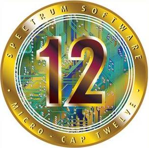

## 👋 &nbsp;Hi there

I am an electrical engineer based in Toronto, Canada. I enjoy working on projects that solve unique problems. I love combining my hobbies like electronics design, 3D printing and coding into various projects with RaspberryPi's, Arduinos, or dedicated PIC MCUs. Slightly obsessed with Home Automation and Home Labs. Feel free to [email me](mailto:matthewsantos@ieee.org) any time or find me on [Linkedin](https://www.linkedin.com/in/matthewjsantos). You can also check out my website at [Matt-Santos.github.io](https://Matt-Santos.github.io).

## 🧰 &nbsp;My toolbox

**Programing Languages**

**Operating Systems**

**Computer Aided Design** (Cadence Orcad, Proteus, Allegro, Keysight EDA/ADS, Pspice, Virtuoso, Spectre, Innovus, Icarus, LTSpice, AutoCAD, Solidworks, MPlabx, Keil Studio, Altium)

**Analysis/Simulation Software** (ANSYS, EMPro, COMSOL Multiphysics)

**Documentation** (Microsoft Office)

**Hardware** (PIC32, STM32)

## Connect with Me

